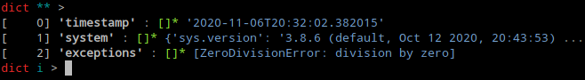
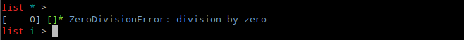
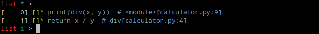
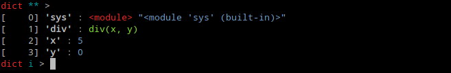

# tibidi

The aim of this library is to provide an option of post-mortem debugging for
the application which would crash on a remote machine, for instance on customer
site.

Project is influenced by [pydump](https://github.com/elifiner/pydump) and
powered by [cloudpickle](https://github.com/cloudpipe/cloudpickle).

## Faulty Application

As an example let's take this code of a simple calculator:

```python
import sys

def div(x, y):
    return x / y

if __name__ == '__main__':
    x = int(sys.argv[1])
    y = int(sys.argv[2])
    print(div(x, y))
```

It will certainly raise an exception when divisor is 0.

```sh
python divide.py 5 0
```

```
Traceback (most recent call last):
  File "divide.py", line 9, in <module>
    print(div(x, y))
  File "divide.py", line 4, in div
    return x / y
ZeroDivisionError: division by zero
```

## Traceback Capturing

We have following options to take traceback down into a file:

1. We can use *tbdump* module in place of *python* interpreter. This will
capture any unhandled `Exception`:

    ```sh
    python -m tbdump divide.py 5 0
    ```

    ```
    ZeroDivisionError: division by zero
    Traceback dumped into: traceback.pkl
    ```

    It is suitable when we have a chance to change the way how Python script is
    invoked. This is also how *tbdump* can be activated from shebang:

    ```python
    #!/usr/bin/env -S python -m tbdump
    ```

2. Alternatively we can install *tbdump* as exception hook using its default
implementation:

    ```python hl_lines="2 3"
    import sys
    import tibidi
    tibidi.set_excepthook()

    def div(x, y):
        return x / y

    if __name__ == '__main__':
        x = int(sys.argv[1])
        y = int(sys.argv[2])
        print(div(x, y))
    ```

    ```sh
    python divide.py 5 0
    ```

    ```
    ZeroDivisionError: division by zero
    Traceback dumped into: traceback.pkl
    ```

3. Finally, we can customize exception handler by preparing its custom
implementation:

    ```python hl_lines="2 8 12-19"
    import sys
    from tibidi import dump_exception

    def div(x, y):
        return x / y

    if __name__ == '__main__':
        try:
            x = int(sys.argv[1])
            y = int(sys.argv[2])
            print(div(x, y))
        except  Exception as exc:
            try:
                dumpfile = 'traceback.pkl'
                dump_exception(exc, dumpfile)
                print(f'{type(exc).__name__}: {exc}')
                print(f'Traceback dumped into: {dumpfile}')
            except Exception:
                print('Failed to dump traceback')
    ```

    ```sh
    python divide.py 5 0
    ```

    ```
    ZeroDivisionError: division by zero
    Traceback dumped into: traceback.pkl
    ```

No matter which option we choose, we should get a `traceback.pkl` file in case
of an exception.

## Traceback Analysis

1. Some developers may prefer to launch their favourite debugger right
away:

    ```sh
    poetry run python -m tbdebug traceback.pkl
    ```

    *tbdebug* uses `breakpoint()`. Behaviour of this function can be adjusted
    using [`PYTHONBREAKPOINT`](https://www.python.org/dev/peps/pep-0553/) variable.

2. Alternatively, simple helper script can be used by hose who would
like to apply any preprocessing in prior to that:

    ```python
    import tibidi
    dump = tibidi.load('traceback.pkl')
    # any preprocessing here
    breakpoint()
    ```

3. Last option is for these developers who are familiar with
[peepshow](https://gergelyk.github.io/peepshow/) and may prefer calling it:

    ```sh
    poetry run python -m tbpeep traceback.pkl
    ```

    
    
    
    


## Limitations

There are a few data types which cannot be pickled. At the time of writing
these include *generator*, *Frame*, *Traceback*. Therefore top-level traceback
and corresponding frames are translated into substitutionary objects. Remaining
objects of illegal types are replaced by objects of `NotPickleable` type.

List of illegal types can be extended by registering custom `islegal` function:

```python
import tibidi
tibidi.config.islegal = lambda obj: not isinstance(obj, (SomeType, AnotherType))
```

There are also a few objects which are recognized by *cloudpickle* as illegal,
e.g. `sys.stdin`. This kind of objects are replaced by instances of `Dummy`
class, which contains error message which explains what has happend during
pickling process.

Last but not least, modules which were captured on a remote host but are not
available in local environment are substituted by objects of `ModuleStub` type
in the process of loading dump files.

Some of the objects may still cause problems in pickling process, or during
loading them back. These objects can be covered by `islegal` as described
above.

More information about problems with pickling can be obtained by setting:

```python
import tibidi
tibidi.config.debug = True
```
